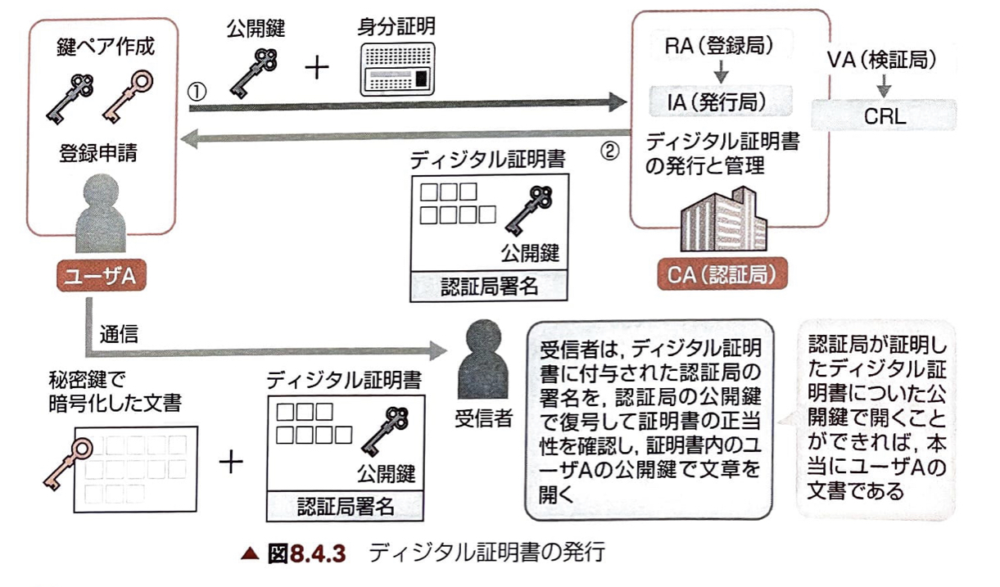

# 1. セキュリティ

## 共通鍵暗号方式
- 暗号化と復号のルールとキーが同一
- 送信者と受信者は同じキーを持つ
- 通信あいてが増えるごとに管理するキーの数が増え、鍵管理の負担が大きくなる
- 共通鍵の配布方法が手間になる

### DES
最も代表的な実装方式が`DES`  
2^56のパターンがある.  
平文を8倍とのブロックに分割し、キーによる変換処理を16回繰り返す.

### AES
`DES`の後継.

## 公開鍵暗号方式
- 公開鍵は広く一般に公開し、誰でも暗号化できる.
- 秘密鍵は、受信者のみが管理するので、受信者だけが暗号化された文書を復号して読むことができる.
- 受信者は、送信者が増えても、秘密鍵を1つ持っていればよいので、鍵管理の負担が少ない.
- 共通鍵暗号方式に比べて、暗号化、復号の処理に時間がかかる.

### RSA
公開鍵暗号方式の代表的な実装方式.  
公開鍵は非常に大きな数値.  
秘密鍵はその素因数分解を行った数値.  

## ハイブリッド方式
共通鍵の受け渡しに公開鍵暗号方式を用いる.  
`S/MIME`, `PGP`, `SSL/TSL`に用いられている.  

## 無線LANの暗号
### WEP
初期の無線LANセキュリティ規格.

### WPA
暗号化アルゴリズム`RC4`を用いた`TKIP`を採用している.  

### WPA2
暗号化方式に`CCMP`を採用している.  
`CCMP`は`CCMP(AES)`とも呼ばれる.

### パーソナルモード
`PSK認証`と呼ばれる認証方式が使われる.

### エンタープライズモード
大規模環境での使用を想定したモード.
`IEEE 802.1X`規格を利用する.  
ネットワーク内に`RADIUSサーバ`を立てる必要がある.  

### IEEE 802.1X
`サプリカント`: 認証を要求するクライアント  
`オーセンティケータ`：認証要求を受け付ける機器  
`認証サーバ`: RADIUSサーバ  

## 認証
### 辞書攻撃
辞書にある単語を片っ端から入力して、パスワードを割り出す方法.  
対策: 辞書にある単語は使わず、ランダムな文字列でパスワードを設定する.  

### ブルートフォース攻撃
総当たり攻撃とも呼ばれる.  
文字を組み合わせてあらゆるパスワードでログインを何度も試みる手法.  
対策: ログインの試行回数に制限を設ける.  

### チャレンジレスポンス認証
1. クライアントがユーザIDを送信する.
2. サーバはチャレンジコード(使い捨ての乱数)をクライアントに送信する.
3. クライアントはチャレンジコードとパスワードを元に生成したハッシュ値をサーバーに返信する
4. サーバは、自分が計算したハッシュ値と、クライアントから送られたハッシュ値を比較し、ユーザー認証を行う.

パスワード自体がネットワーク上を流れないようにしている.

### ハッシュ関数
あるデータを元に行って胃腸の擬似乱数を生成する計算手順.  
生成した値をハッシュ値、もしくはメッセージダイジェストという.  
生成したハッシュ値から元のデータを復元できないという性質(原像計算困難性)があることから不可逆関数, 一方向関数とも呼ばれる.

### ワンタイムパスワード
- 時刻同期方式
- S/KEY方式

### シングルサインオン
#### Cookie型
サーバが認証のための情報を生成してクライアントに送信する.   
クライアントはこれを保存し、他のサーバへはこの認証情報を自動的に送ることで、認証を受けることが出来る仕組み.

#### リバースプロキシ型
ユーザはリバースプロキシサーバにアクセスし、認証を受ける.   
ユーザは、このリバースプロキシサーバを通じて他のサーバに接続するため、各サーバの認証はリバースプロキシサーバが自動的に代行する.

#### SAML型
アプリケーション連携を行うためのXML仕様.  
利用するサービスがSAMLに対応していれば、HTTPなどを用いて複数のサービス間で認証情報が自動的にやりとりされる.

### バイオメトリクス認証
#### 指紋認証
::要確認::
#### 声紋認証
::要確認::
#### 虹彩認証
::要確認::
### その他の認証
#### リスクベース認証
::要確認::
#### Kerberos方式
::要確認::
#### 2要素認証
::要確認::
#### CAPTCHA認証
::要確認::

### リモートアクセス
#### PPPの認証技術
`PPP`: Point to Point Protocol. 電話回線で２点間の通信を行うためのデータリンク層のプロトコル.  
`NCP`: 上位プロトコル(IP, IPXなど)に対応した接続モジュールを使ってネットワーク層プロトコルの設定をネゴシエーションする.  
`LCP`: 認証や暗号化の有無などを相手ノードとネゴシエーションする.  

利用される認証プロトコル  
`PAP`:
`CHAP`: 

### RADIUS認証
Remote Authentication Dial-in User Service.  
アクセスサーバーと認証サーバーを分離することで脆弱性を緩和する.  

#### IEEE 802.1X
イーサネットや無線LANにおけるユーザ認証のための規格.  
認証の仕組みとして`RADIUS`を採用している.
認証プロトコルには`PPP`を拡張した`EAP(Extended authentication protocol)`が使われている.  
 
以下の3つの構成要素を持つ.  
  `サプリカント`: 認証要求するクライアント  
  `オーセンティケータ`: 認証要求を受け付ける機器. スイッチやアクセスポイント.  
  `認証サーバ`  

## デジタル署名とPKI
### デジタル署名の基本的な仕組み
平文に対して秘密鍵を適用してデジタル署名を作り、平文と共に受信者に送付する.  
受信者は、公開されている送信者の公開鍵を用いてデジタル署名を復号する.  
公開鍵に対応する秘密鍵を持っているのは、公開鍵を公開した送信者だけなので、公開鍵でデジタル署名を復号できれば、送信者が本人であることを確認できる.  

また、送られてきた平文と復号された平文を突き合わせることで、改ざんの有無を検査することもできる.  

### メッセージダイジェスト
可変長の平文に対してハッシュ演算を行い、得られた固定長の`メッセージダイジェスト`からデジタル署名を作成する.  
復号しても得られるのは平文の要約だけのため、セキュリティが向上する.  

`MD5`: 任意の長さの平文から128ビットのハッシュ値を生成  
`SHA-1`: 任意の長さの平文から160ビットのハッシュ値を生成. MD5よりも復元が難しい. SHAは"Secure Hash Algorithm"の略  
`SHA-2`: `SHA-1`の後継規格. ハッシュ値の長さにより、`SHA-224`, `SHA-256` `SHA-384`, `SHA-512`がある. これらをまとめて`SHA-2`と表現する.  
`SHA-3`: アルゴリズムを抜本的に変更することを目論んだ規格. 

### PKI(公開鍵基盤)
公開鍵が本人と結び付けられた正当なものであることを証明するための仕組み.  
#### 認証局(CA)

`CP`: 証明書の目的や利用用途を定めたもの.  
`CPS`: CAの認証業務の運用などに関する詳細を定めたもの.  

#### デジタル証明書の失効情報
`CRL`: 有効期限内に何らかの理由で失効させられたデジタル証明書のリスト.  

### SSL/TLS
Secure Sockets Layer/Transport Layer Security.  
通信の暗号化、改ざんの検出、サーバの認証を行うセキュアプロトコル.  
アプリケーション層の下位に位置する.  

#### TLSでの通信
##### ハンドシェイクでの通信
サーバを認証して、暗号化鍵を作るためのステップ.  
ここでTSLの通信路を構築し、その通信路を使って暗号化通信を行う.  

##### データの転送(暗号化通信)
送信データに`MAC`と呼ばれる認証符号を付加し、送信データと`MAC`を暗号化して送信する.  
`MAC(メッセージ認証符号)`: 計算元のデータが異なるとMACも異なるという性質を持つため、データの改ざんを検出できる.  

#### サーバ認証とクライアント認証

| 証明書 | description |
|-------|-------------|
| DV証明書|
| OV証明書| 
| EV証明書|

**skip**

## 情報セキュリティ対策

### コンピュータウイルス
| ウイルス  | 機能 |
|-------  |------|
|自己伝染機能| 自身やシステムの機能を使って、他のシステムに自分のコピーを作成する
|潜伏機能|ウイルスとしての機能を起動するまでに一定の期間や条件を定めて、それまでは沈黙している
|発病機能|メッセージの表示や、ファイルの破損、個人情報の流出などを行う

#### 感染経路
ウイルス感染を容易にする要素
| 要素 | 詳細 |
|------|-----|
|セキュリティホール| セキュリティ上の弱点. 主にOSなどのソフトウェアに存在する設計・開発時における瑕疵を指す.
| バックドア | ウイルスなどが作成するシステム上の抜け道. 
| マクロ | ワープロや表計算でのプログラミング機能. マクロウイルスと正当なマクロを区別するのは難しい. 

#### 対策
##### ウイルスチェックソフト
パターンファイル(シグネチャ)と呼ばれるウイルスの特徴を記載したデータベースを保持して、メールやホームページの閲覧データを常時チェックする.  
パターンファイルは過去のウイルス情報の蓄積なので、最新のウイルスには対応できないことや、常に新しいパターンファイル情報を取得が必要不可欠.  

##### セキュリティパッチ

